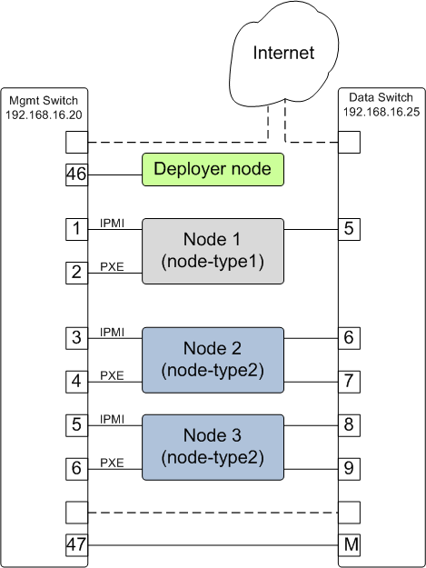

.. _appendix_d:

Appendix - D Example system 1 -  Basic Flat Cluster
===================================================

     A basic flat cluster with two node types

**A Sample config.yml file for a basic flat cluster**

The config file below defines two compute node templates with multiple network
interfaces. The deployer node needs to have access to the internet which shown
via one of the dotted line paths in the figure above or alternately via a
wireless or dedicated interface.

.. literalinclude:: ../sample-configs/basic.config.ubuntu.yml
    :language: yaml
