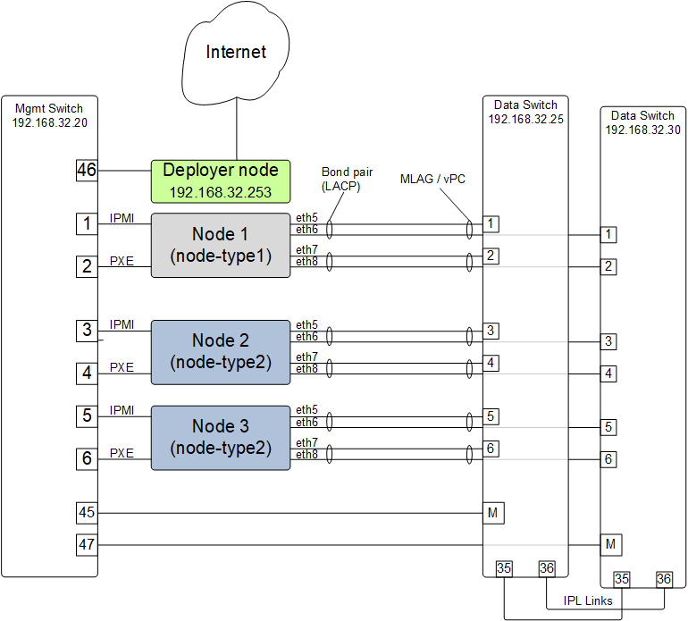

Appendix - E Example system 2 - Basic Cluster with High Availability Network
=============================================================================

   High Availability Network using MLAG / vPC

The config file below defines two compute node templates and multiple network
templates.  The sample cluster can be configured with the provided config.yml file.
The deployer node needs to have access to the internet for accessing packages.

Various OpenPOWER nodes can be used such as the S821LC.  The deployer node can be OpenPOWER
or alternately a laptop which does not need to remain in the cluster.  The data switch can be
Mellanox SX1700 or SX1410.

.. literalinclude:: ../sample-configs/mlag.config.ubuntu.yml
    :language: yaml
