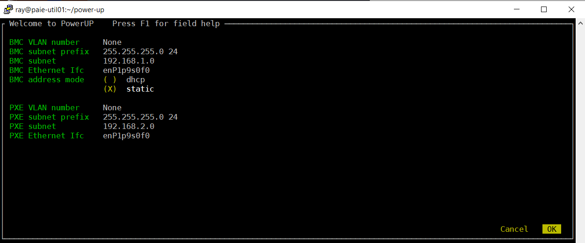
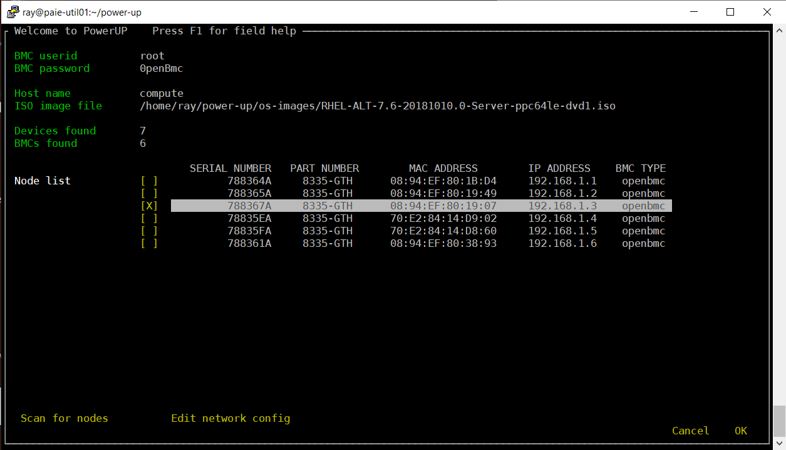
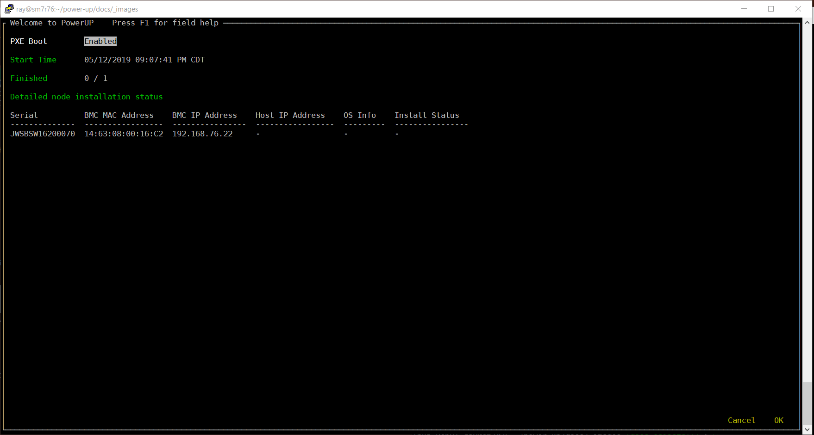
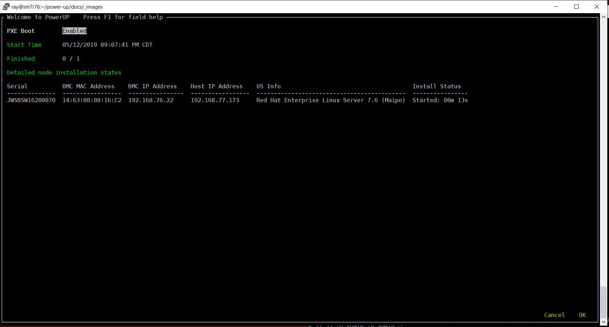

.. highlight:: none

.. _running_os:

Running Operating System Install
================================

The PowerUp Operating system installer is a simple to use windowed (TUI) interface that provides rapid deployment of operating systems to similar nodes. Power8 and Power9 OpenPOWER nodes including those with OpenBMC are supported. Because the installer uses industry standard PXE protocols, it is expected to work with most x86 nodes which support PXE boot.

The OS installer is invoked from the command line;

    pup osinstall {profile.yml}

The process takes just three easy steps

#. Enter network subnet info and select the interface to use.
#. Enter BMC access info, choose an ISO image, Scan the BMC network subnet and select the nodes to install.
#. Install. A status screen shows the progress of nodes being installed.

Network Interface Setup
-----------------------

     Network interface setup

**The network interface setup window**

At a minimum, you need to select a network interface on the PowerUp install node to be used for communicating with the nodes to be installed. You can accept the default private subnets or enter in your own subnet addresses and subnet masks.

Note that you can obtain help on any entry field by pressing F1 while in that field. Some fields such as the interface selection fields are intelligent and may change or autofill based on other fields. For instance the interface selection fields will autofill the interface if the there is an interface on the install node with a route matching the entered subnet and mask. If it does not autofill, press enter and select an interface from the available 'up' physical interfaces. You can use the same interface for accessing the BMCs and PXE ports or different interfaces. If needed, PowerUp will add addresses and create tag'ed interfaces on the install node. Network changes are temporary and will not survive reboots or network restarts.

Node Selection
--------------

     Node Selection

**The Node Selection window**

At a minimum, you need to enter access credentials for the target nodes BMCs and select an ISO image file. All nodes being deployed must have the same userid and password. Press enter in the ISO image file field to open a file browser/selection window. Move to the 'scan for nodes' button and press enter to scan the BMC subnet for nodes. After several seconds the nodes scan should complete. Scroll through the list of nodes and press enter to select nodes to install. When done, press 'OK' to begin OS installation.

Installation Status
-------------------

     Node installation status

**The Node Installation Status window**

After a minute or so, the selected nodes will be set to PXE boot and a reboot will begin. An installation status window will open. The nodes will be listed but status will not begin updating until they have rebooted and started the installation process which typically takes a couple of additional minutes. Once the nodes start to install, the status will show started and an elapsed time will appear. Once installation completes, the status will change to 'Finished' and a final time stamp will be posted. At this points the nodes are rebooted a second time. After the second reboot, the nodes should be accessible at the host ip address in the status window and the user credentials in the kickstart or preseed file.

     Node installation started status
